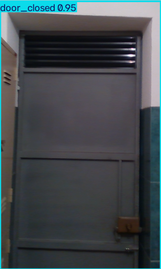
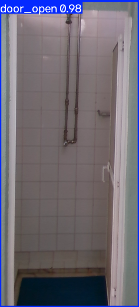
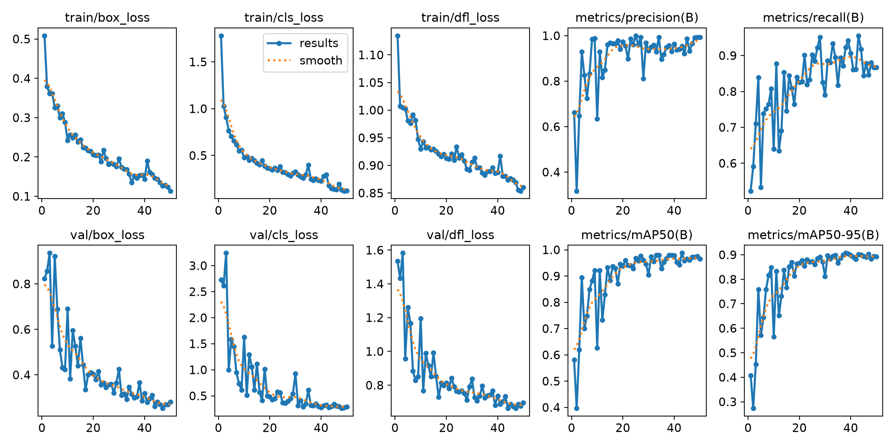
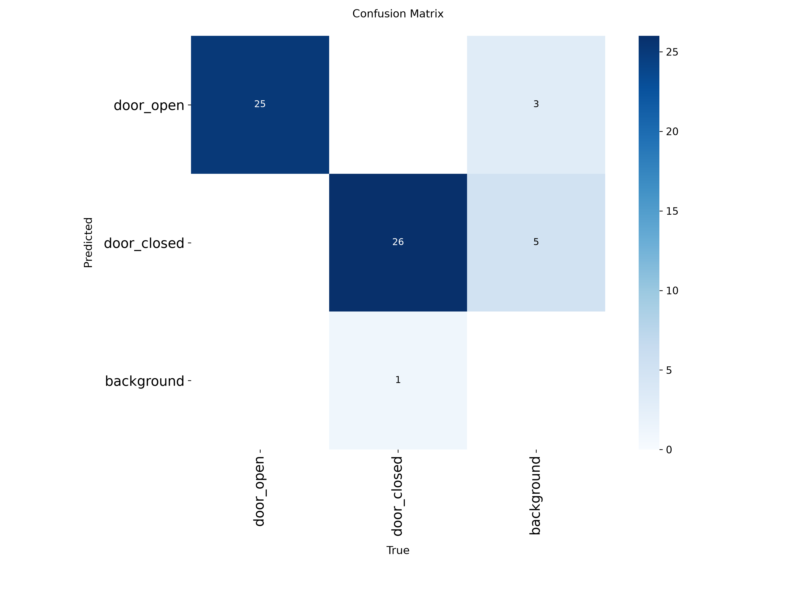
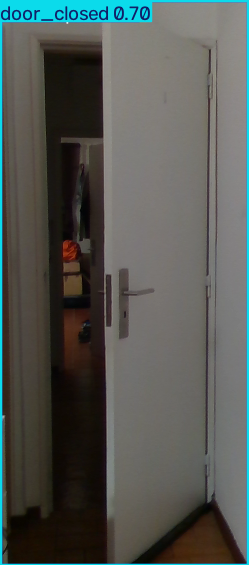
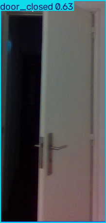
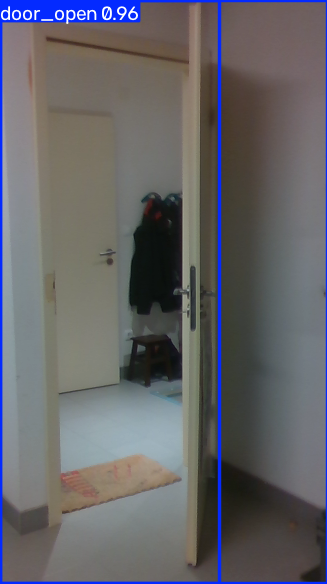

# Door Open / Closed Detection — YOLO

Junior AI Engineer technical task: detect whether a door is `door_open` or `door_closed`.

## Setup
```bash
python -m venv .venv
.venv\Scripts\activate
pip install -r requirements.txt
```

## 1. Data
Drop the Roboflow YOLOv8 export zip into `raw_data/`. The GitHub DoorDetect
classification zip can be referenced from wherever you downloaded it (e.g. `Downloads`).

```bash
python scripts/prepare_dataset.py --roboflow raw_data/closeddoors.zip --github "C:/Users/BISWAJEET/Downloads/Door Classification-....zip"
```

This builds `dataset/` (YOLO format, 2 classes: `door_open`, `door_closed`) and
sets aside the ambiguous "Semi" (half-open) images in `predictions/semi_holdout/`
for failure-analysis discussion.

## 2. Train — 3 hyperparameter experiments
```bash
python scripts/run_experiments.py
```
Trains `exp1_baseline`, `exp2_augmentation`, `exp3_capacity_lr` (see the script
to edit hyperparameters), evaluates each on the test split, times inference
latency, and writes `experiments/results.csv`.

## 3. Export + sample predictions
```bash
python scripts/export_and_predict.py --experiment exp1_baseline
```
(swap in whichever experiment name came out best) — exports `best.pt` to ONNX,
sanity-checks it with onnxruntime, and saves 5 example predictions to
`predictions/examples/`.

| `door_closed` | `door_open` |
|---|---|
|  |  |

## Results




| Experiment | Precision | Recall | F1 | mAP@0.5 | mAP@0.5:0.95 | Latency (ms/img) |
|---|---|---|---|---|---|---|
| exp1_baseline | 0.998 | 0.998 | 0.998 | 0.995 | 0.965 | 17.5 |
| exp2_augmentation | 0.994 | 0.898 | 0.944 | 0.976 | 0.944 | 18.7 |
| exp3_capacity_lr | 0.991 | 0.977 | 0.984 | 0.989 | 0.964 | 19.1 |

**Best model:** `exp1_baseline` on this test split (highest across every metric, cheapest model, lowest latency). `exp3_capacity_lr` (yolov8s + AdamW/lower LR) is the closest runner-up and the more robust pick if the val/test split isn't representative of harder real-world conditions, since it has near-identical mAP50-95 with much better recall than exp2.

**Why it performed better:** the dataset's door_open/door_closed distinction is visually easy (mostly full-frame, unoccluded doors), so the small yolov8n baseline already saturates precision/recall — extra capacity (exp3) or augmentation (exp2) has little room to help and mainly trades recall for robustness.

**Which hyperparameters had the biggest impact:** augmentation strength (exp2) had the biggest — and a *negative* — effect: heavy mosaic/mixup/HSV/rotation dropped recall from 0.998 to 0.898 (more false negatives), because the augmentations distort door geometry/aspect-ratio cues the model relies on more than they add useful invariance for this task. Model capacity + optimizer/LR (exp3: yolov8s, AdamW, lr0 0.005) recovered most of that recall (0.977) versus exp2, at the cost of ~2x the parameters and marginally higher latency — a reasonable trade only if extra augmentation-driven robustness were actually needed.

**Where the model still fails:** ran `exp1_baseline` (best model) over a sample of `predictions/semi_holdout/` (150 ambiguous "half-open" images set aside from training) — annotated output in `predictions/semi_holdout_annotated/`. Two concrete failure patterns showed up:
1. **Near-tied conflicting detections** on the same door: e.g. `gh_door0000328.png` fires both `door_closed 0.70` and `door_open 0.53` on the same box, `gh_door0000022.png` fires `door_closed 0.63` / `door_open 0.63` — essentially a coin-flip, because the model was never trained on this middle state and has no calibrated way to express "unsure."
2. **Duplicate boxes for one door** on ambiguous frames, e.g. `gh_door0000305.png` returns two overlapping `door_open` boxes (0.96, 0.89) for a single door — NMS not fully collapsing two candidate anchors when the door's visual signal doesn't cleanly match either training class.

| Near-tied conflict | Near-tied conflict | Duplicate boxes |
|---|---|---|
|  |  |  |

Clearly-open or clearly-closed holdout images (even ones the model hadn't seen) are still classified confidently and correctly, so the failures are specific to the "genuinely ambiguous" half-open middle ground — the expected limitation of a 2-class detector applied to what is really a 3-state real-world phenomenon, not a training bug. A production fix would be a `door_ajar`/third class, or a confidence-gap threshold that flags near-tied predictions as "uncertain" instead of forcing a class.

## Note: box-quality caveat
Only 145/1,201 images (12%, from Roboflow) have real hand-drawn boxes; the rest are auto-generated full-frame boxes (the GitHub source only had whole-image open/closed labels, no box). This makes the metrics above closer to *classification* accuracy than true localization — any reasonably-sized predicted box scores well against a full-frame "ground truth." We tested fixing this (AI-assisted relabeling of ~850 images with real boxes) and confirmed the model does learn genuine tight-box localization, but mAP then *drops* on this test set, because the test labels are still full-frame — the metric penalizes a more precise model for no longer taking the full-frame shortcut. Fixing this properly means relabeling train **and** test consistently, which is beyond this task's scope; the results above are left as the original full-frame-labeled baseline.

## Dataset sources
- [ClosedDoors — Universidade do Estado do Amazonas](https://universe.roboflow.com/universidade-do-estado-do-amazonas-4caxo/closeddoors) (2,896 images, CC BY 4.0)
- [DoorDetect-Class-Dataset (GitHub)](https://github.com/gasparramoa/DoorDetect-Class-Dataset)
